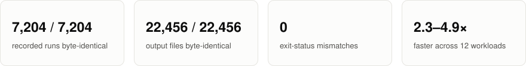
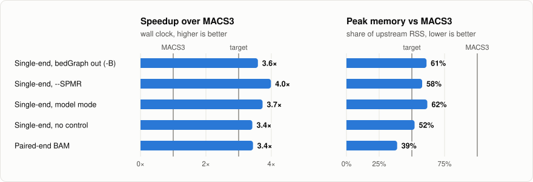

# macs3-rs

A Rust reimplementation of [MACS3](https://github.com/macs3-project/MACS), the
standard peak caller for ChIP-seq and ATAC-seq. Same 14 subcommands, same flags,
same output filenames — and on every recorded run, **the same output bytes**.
It runs 2.3–4.9× faster and uses 17–101% of the memory.

<picture>
  <source media="(prefers-color-scheme: dark)" srcset="docs/figures/parity-dark.svg">
  
</picture>

> **Status: a development project, not a release.** All 14 subcommands are
> implemented and the recorded corpus is at byte parity, but that corpus only
> covers `callpeak`. The other 13 commands are verified by smaller comparisons,
> listed command by command in [docs/compatibility.md](docs/compatibility.md).

## Byte-identical, not "close enough"

MACS3's own `test/cmdlinetest` accepts a peak file whose Jaccard index is above
0.99 even when the bytes differ — that is its stated pass criterion for peak
output. This project requires the bytes themselves to be identical, because a
p-value that moves in the fourth decimal is a different answer, and anything
downstream that diffs, caches or checksums those files will notice.

Every row below is reproducible from a clean checkout; the script that produces
each one is named in the left column.

| check | result |
|---|---|
| Recorded `callpeak` corpus: 7,204 runs over 425 fixtures and 20 option variants — `oracle/run_golden.sh` | **22,456 / 22,456** output files byte-identical |
| 481 invalid invocations — `oracle/run_golden.sh` | **0** exit-status mismatches |
| The same 7,685 runs replayed at 1 thread and at 32 — `oracle/check_thread_invariance.py --limit 0` | **0** runs differ |
| Fresh real-data `callpeak`, single-end / BEDPE / BAMPE, all summit outputs — `oracle/check_real_summit_bytes.py` | **16 / 16** files byte-identical |
| `hmmratac` self-training and decoding on yeast ATAC-seq — `oracle/check_hmmratac.py` | **1,605 / 1,605** regions shared, Jaccard 1.0000, 0 bp summit shift |
| `callvar` with assembly off / auto / on — `oracle/check_callvar.sh` | **22/22, 16/16, 15/15** variant records identical |
| Exit-status contract, and errors must precede any output file — `oracle/check_exit_contract.py` | **3 / 3** pass |
| Every accepted flag must actually change the output — `oracle/audit_accepted_flags.py` | no silent no-ops |
| Unit tests — `cargo test --workspace` | **897** pass |

The corpus is pinned to MACS3 3.0.5 at commit `c5443190`. Upstream is a git
checkout and a Python environment, deliberately *not* vendored, so the reference
cannot be edited to make a test pass.

Only one normalisation is applied anywhere: the `# Command line:` header of
`*.xls`, which necessarily names a different executable and output directory.
Every other byte is compared unchanged.

Reaching byte parity meant reproducing upstream's arithmetic rather than
approximating it — float32 widths, NumPy's summation order, its Mersenne
Twister stream, and a number of upstream bugs. The
[findings log](docs/upstream-findings.md) records each one as F1 through F273,
every entry citing the upstream line it came from and how this port treats it.

## Performance

<picture>
  <source media="(prefers-color-scheme: dark)" srcset="docs/figures/performance-dark.svg">
  
</picture>

Real CTCF ChIP-seq, 5 M treatment + 5 M control reads, median of 3 runs on a
Ryzen 7 3700X. The bedGraph commands read the pileup, lambda and p-score tracks
MACS3 itself writes for those reads, so both sides parse identical input.
Reproduce with [`scripts/bench_real.py`](scripts/bench_real.py).

| workload | MACS3 3.0.5 | macs3-rs | speedup | peak memory |
|---|---|---|---|---|
| `callpeak`, single-end `-B` | 43.1 s / 294 MB | 12.6 s / 165 MB | 3.4× | 56% |
| `callpeak`, single-end `--SPMR` | 32.4 s / 298 MB | 8.5 s / 139 MB | 3.8× | **47%** |
| `callpeak`, single-end `--broad` | 37.7 s / 294 MB | 10.4 s / 151 MB | 3.6× | 52% |
| `callpeak`, no control | 17.3 s / 174 MB | 4.6 s / 76 MB | 3.8× | **44%** |
| `callpeak`, paired-end BAM | 1.26 s / 80 MB | 0.34 s / 26 MB | 3.7× | **32%** |
| `pileup` | 7.6 s / 134 MB | 3.3 s / 32 MB | 2.3× | **24%** |
| `filterdup` | 5.5 s / 134 MB | 1.59 s / 22 MB | 3.5× | **17%** |
| `randsample` | 4.4 s / 134 MB | 1.72 s / 93 MB | 2.6× | 70% |
| `bdgpeakcall` | 20.7 s / 224 MB | 4.7 s / 200 MB | 4.4× | 89% |
| `bdgopt -m p2q` | 29.8 s / 231 MB | 6.1 s / 234 MB | 4.9× | 101% |
| `cmbreps -m max` | 43.8 s / 391 MB | 10.4 s / 194 MB | 4.2× | **50%** |
| `bdgcmp -m ppois` | 59.0 s / 612 MB | 19.4 s / 195 MB | 3.0× | **32%** |

Every workload is faster. Bold marks memory at or under the project's own target
of half of MACS3's; seven of twelve meet it, and the five that don't are named
in [the status section](#status).

The script also byte-compares both sides on its first repetition, so the numbers
above come with an output check attached. Ten of the twelve are identical; the
two that are not are `filterdup` and `randsample`, for the chromosome-ordering
reason given under [drop-in replacement](#is-it-a-drop-in-replacement).

The memory result came from writing output as it is produced rather than
buffering it. An earlier version of this port held whole files in memory and was
*worse* than upstream — `bdgcmp` at 1,383 MB against upstream's 611 MB, `pileup`
at 313 MB against 134 MB. Streaming the writers and scoring rows during the
merge is what brought `bdgcmp` to 195 MB. [Where the memory
goes](docs/compatibility.md#where-the-memory-goes) has the breakdown.

## Is it a drop-in replacement?

Two different claims, with two different amounts of evidence behind them.

**The command line is a drop-in surface for all 14 subcommands.** Names, flags,
aliases, defaults, `nargs` and mutually exclusive groups are taken from upstream's
`argparse` definitions rather than guessed, and parsing reproduces argparse's own
behaviour — attached short-option values (`-q0.05`), unambiguous long prefixes,
Python numeric literals, `--`, and the same accept/reject decision. Exit status
follows upstream's contract: 2 for a usage error, 1 for a runtime error, never a
Rust panic's 101. Validation happens before the writer opens, so a rejected run
leaves no partial output behind, exactly as upstream does. And output does not
depend on the thread count.

**Byte-identical output is a drop-in claim only where it has been measured**, and
that is currently `callpeak` at corpus scale, plus the command-by-command checks
in [docs/compatibility.md](docs/compatibility.md).

Five behavioural differences are known, and none of them is silent:

- `filterdup` writes the same rows in a different chromosome order on
  multi-chromosome input, and seeded `randsample` picks different reads. MACS3
  iterates chromosomes in Python hash order, which is randomised per process —
  two runs of MACS3 itself disagree. This port sorts.
- `hmmratac` model files agree to about 2 × 10⁻¹⁰, which is where two runs of
  MACS3 stop agreeing with each other.
- The `callvar` VCF header echoes the output path, so it differs when the path
  does.
- MACS3's SAM parser crashes on any minus-strand read. This port parses SAM, and
  matches on input MACS3 can read.
- There is no `--threads` flag, because MACS3 rejects one and a drop-in
  replacement has to as well. Use `MACS3_RS_THREADS`.

## Quick start

```sh
cargo install --path crates/macs-cli
macs3-rs callpeak -t chip.bed.gz -c input.bed.gz -f BED -g hs -n sample
```

## How it is verified

Six CI layers, one job each, so a failure names the layer that broke. The
differential layers provision the pinned MACS3 3.0.5 oracle themselves; the
others run on a stock Rust image with no Python at all, which is itself part of
the point — the shipped binary must not need an interpreter.

| layer | what it proves |
|---|---|
| **L1** unit | 897 tests, plus `clippy -D warnings` and `cargo fmt --check` |
| **L2** invariants | property tests over the RLE, pileup, scoring and statistics cores |
| **L3** differential | stage-by-stage comparison against the live oracle |
| **L4** golden | byte-for-byte replay of all 7,685 recorded invocations |
| **L5** regression | a fixture per recorded finding |
| **L6** fuzzing | nightly libFuzzer over the parsers and numeric kernels |

The golden corpus can only catch bugs in invocations someone thought to try, and
the two worst defects found here were in flags it never exercised: `-p` was
accepted and then silently ignored, and `--min-length` and `--max-gap` were
parsed and thrown away. Both were found by sweeping the CLI rather than by
replaying the corpus, both were found *after* the corpus was already green, and
both are why `audit_accepted_flags.py` is a CI gate rather than a nicety.

## How it is built

14 crates, from `macs-core` and `macs-stats` up to `macs-cli`, under `crates/`.
`oracle/` is the differential harness that replays recorded MACS3 runs and
compares bytes; `tests/` holds the fixtures and the recorded outputs.

```sh
cargo test --workspace     # 897 tests
oracle/run_golden.sh       # replay every recorded run, compare every byte
```

## Status

Recorded corpus at byte parity; all 14 subcommands implemented and differentially
checked against the pinned oracle; faster on every measured workload.

- **Not a release.** Only `callpeak` has a recorded corpus. The other 13
  commands were verified on real data in smaller ad-hoc comparisons, which is
  weaker evidence — three real bugs in the bedGraph commands were found that way
  after the corpus was already green. Widening the corpus is the top open item.
- **One real dataset.** All real-data numbers come from one 5 M-read CTCF
  experiment plus the chr22 and yeast files MACS3 ships. No histone marks, no
  deep library, no second genome.
- **Five workloads exceed the memory target:** `callpeak -B` (56%), `--broad`
  (52%), `randsample` (70%), `bdgpeakcall` (89%), `bdgopt` (101%).
- **`callvar` is not fully pure Rust:** the fermi-lite assembler is bridged
  through C.

[Compatibility by command](docs/compatibility.md) ·
[generated parity matrix](docs/compatibility-matrix.md) ·
[current status](docs/status.md) · [porting plan](PORTING_PLAN.md)

## Licence

BSD-3-Clause, matching MACS3. The vendored fermi-lite sources keep their MIT
licence.